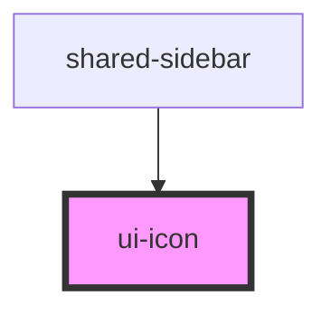

# ui-icon

<!-- Auto Generated Below -->

## Properties

| Property         | Attribute         | Description                                                                      | Type                                                                          | Default     |
| ---------------- | ----------------- | -------------------------------------------------------------------------------- | ----------------------------------------------------------------------------- | ----------- |
| `class`          | `class`           | Custom CSS class to apply                                                        | `string`                                                                      | `undefined` |
| `clickable`      | `clickable`       | Whether the icon should be clickable                                             | `boolean`                                                                     | `false`     |
| `color`          | `color`           | The color of the icon                                                            | `"danger" \| "neutral" \| "primary" \| "secondary" \| "success" \| "warning"` | `null`      |
| `decorative`     | `decorative`      | Whether the icon is decorative (no aria-label needed)                            | `boolean`                                                                     | `false`     |
| `flipHorizontal` | `flip-horizontal` | Whether the icon should be flipped horizontally                                  | `boolean`                                                                     | `false`     |
| `flipVertical`   | `flip-vertical`   | Whether the icon should be flipped vertically                                    | `boolean`                                                                     | `false`     |
| `hoverable`      | `hoverable`       | Whether the icon should have a hover effect                                      | `boolean`                                                                     | `false`     |
| `label`          | `label`           | The label for accessibility (aria-label)                                         | `string`                                                                      | `undefined` |
| `name`           | `name`            | The name of the icon to display (Phosphor icon name)                             | `string`                                                                      | `undefined` |
| `rotate`         | `rotate`          | Whether the icon should be rotated                                               | `0 \| 180 \| 270 \| 90`                                                       | `0`         |
| `size`           | `size`            | The size of the icon                                                             | `"large" \| "medium" \| "small" \| "x-large"`                                 | `'medium'`  |
| `spinning`       | `spinning`        | Whether the icon should be spinning                                              | `boolean`                                                                     | `false`     |
| `type`           | `type`            | The type/weight of the Phosphor icon (regular, bold, fill, duotone, light, thin) | `"bold" \| "duotone" \| "fill" \| "light" \| "regular" \| "thin"`             | `'regular'` |

## Dependencies

### Used by

 - [shared-sidebar](../sidebar)

### Graph

----------------------------------------------

*Built with [StencilJS](https://stenciljs.com/)*
