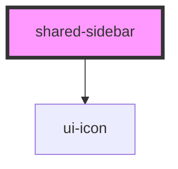

# shared-sidebar

<!-- Auto Generated Below -->

## Properties

| Property    | Attribute   | Description | Type               | Default |
| ----------- | ----------- | ----------- | ------------------ | ------- |
| `collapsed` | `collapsed` |             | `boolean`          | `false` |
| `sections`  | `sections`  |             | `SidebarSection[]` | `[]`    |

## Dependencies

### Depends on

- [ui-icon](../icon)

### Graph

----------------------------------------------

*Built with [StencilJS](https://stenciljs.com/)*
